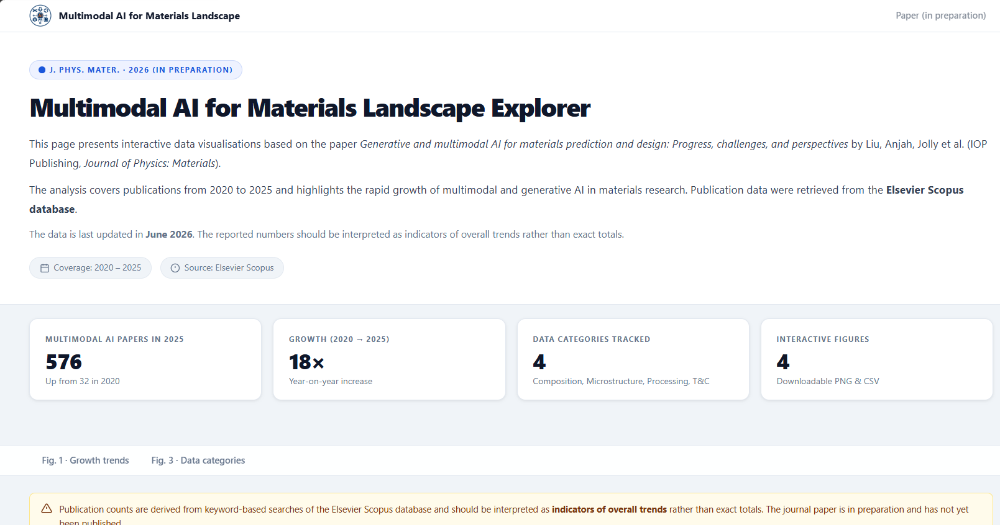

# Multimodal AI for Material Science — [Explorer 🧪](https://multimodalai.github.io/multimodal-ai-for-materials-landscape/)


Navigate with the [**Interactive Explorer**](https://multimodalai.github.io/multimodal-ai-for-materials-landscape/).

<div align="center">
  <a href="https://multimodalai.github.io/multimodal-ai-for-materials-landscape/">
    
  </a>
</div>
<div align="center" style="margin-top: 0; margin-bottom: 12px;">
  <em>Click the image to explore.</em>
</div>

---

## Overview

This explorer presents publication trend data retrieved from the **Elsevier Scopus database**, covering multimodal and generative AI research in materials science from 2020 to 2025. It reproduces the interactive equivalents of **Figure 1** and **Figure 3** from the paper.

---

## Repository structure

```
material-landscape/
├── index.html                          # One-page dashboard
├── LICENSE                             # MIT Licence
├── README.md
├── explorer-preview.png                # Preview image
├── assets/
│   ├── css/styles.css                  # Shared stylesheet
│   ├── js/
│   │   ├── common.js                   # Shared helpers: CSV/JSON cache, footer injection,
│   │   │                               #   skeleton loader, download helpers, last-updated
│   │   └── explore.js                  # Four chart renderers + stats loader (loads from CSV)
│   ├── img/multimodalai-logo.png       # Site logo
│   └── meta/build.json                 # Build timestamp (last-updated fallback)
├── data/
│   ├── datasets.json                   # Manifest listing all datasets
│   └── material-landscape/             # Dataset folder
│       ├── meta.json                   # Dataset descriptor (title, coverage, figure → CSV map)
│       ├── summary.json                # Precomputed stats for home-page cards
│       ├── fig1a-proportions.csv       # Fig. 1a — proportion of MM AI, Gen AI, MM Gen AI
│       ├── fig1b-property-design.csv   # Fig. 1b — property prediction vs materials design counts
│       ├── fig3a-category-counts.csv   # Fig. 3a — absolute counts by data category
│       └── fig3b-category-proportions.csv  # Fig. 3b — proportional breakdown by data category
└── scripts/
    └── generate_datasets_manifest.mjs  # Node.js: scans data/ and writes datasets.json
```

---

## Data files

All CSV files live under `data/material-landscape/`. The `meta.json` descriptor maps figure keys
to CSV filenames, allowing the site to resolve paths without hardcoding them in JavaScript.

| File | Description |
|------|-------------|
| [`fig1a-proportions.csv`](data/material-landscape/fig1a-proportions.csv) | Annual proportion (%) of multimodal AI, generative AI, and their intersection relative to all AI for materials publications |
| [`fig1b-property-design.csv`](data/material-landscape/fig1b-property-design.csv) | Annual counts of multimodal AI publications in property prediction and materials design |
| [`fig3a-category-counts.csv`](data/material-landscape/fig3a-category-counts.csv) | Annual absolute counts of multimodal AI publications by data category (composition, microstructure, processing, T&C) |
| [`fig3b-category-proportions.csv`](data/material-landscape/fig3b-category-proportions.csv) | Annual proportional breakdown (%) by data category |

---

## Scopus search queries

Publication data were retrieved using targeted keyword searches in the Elsevier Scopus database.

| Category | Key terms |
|----------|-----------|
| **AI for materials** | "machine learning" OR "deep learning" OR "artificial intelligence" OR "neural network" OR "graph neural network" OR transformer OR "foundation model" OR "large language model" AND material\* OR alloy\* OR crystal\* OR polymer\* OR ceramic\* OR semiconductor\* |
| **Multimodal AI** | Above AND ("multimodal" OR "multi-modal" OR "multi modality" OR "multi-modality") |
| **Generative AI** | Above AND (generative OR "generative model" OR "generative AI" OR VAE OR GAN OR "diffusion model") |
| **Composition** | Multimodal AND (composition OR stoichiometr\* OR "chemical formula" OR "elemental composition") |
| **Microstructure** | Multimodal AND (microstructure OR microstructural OR grain\* OR EBSD OR SEM OR TEM) |
| **Processing** | Multimodal AND ("processing parameter\*" OR "heat treatment" OR anneal\* OR quench\* OR "additive manufacturing") |
| **Testing & characterisation** | Multimodal AND (characterisation OR measurement\* OR testing OR spectroscopy OR diffraction OR XRD OR Raman) |

---

## Regenerating the dataset manifest

After adding or renaming a dataset folder under `data/`, regenerate `data/datasets.json`:

```bash
node scripts/generate_datasets_manifest.mjs
```

---
## Licence

[MIT](LICENSE) — © 2026 University of Sheffield
